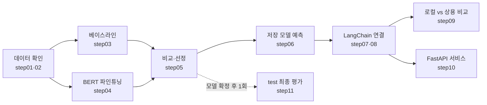

# 🚀 실행 확인 가이드

이 저장소를 받은 뒤 **발제문 STEP 3~7이 실제로 돌아가는지** 순서대로 확인하는 방법입니다.
2026-10-08에 팀 공통 노트북(RTX 5060)에서 직접 실행한 결과를 **기준값**으로 함께 적었습니다. 전체 약 15분 걸립니다.

> 숫자는 시드가 고정돼 있어 거의 같게 나옵니다. 생성 모델의 답변 문장과 응답 시간은 실행할 때마다 조금씩 달라집니다.

현재 분류 학습은 실행 이름을 자동 생성하고 비교마다 별도 이력을 남깁니다.
이 문서의 `baseline`, `lr2e5` 이름과 GPU 수치는 이전 실행 기준 기록입니다.
새 경로·명령·호환성은 [실험 저장 문서](docs/EXPERIMENT_STORAGE.md)를 참고하세요.

## 🗺️ 전체 흐름



## 📋 한눈에 보기

| # | 발제문 | 하는 일 | 명령 | 기준 결과 |
|---|---|---|---|---|
| 1 | 준비 | 환경 점검 | `uv run python steps/check_environment.py` | GPU True, Ollama 모델 목록 |
| 2 | 준비 | 테스트 | `uv run python -m pytest` | 52 passed |
| 3 | STEP 3 | 데이터 읽기 | `uv run python steps/step01_read_data.py` | 360행, 라벨별 120 |
| 4 | STEP 3 | 분할 검사 | `uv run python steps/step02_check_data.py` | 중복 검사 통과 |
| 5 | STEP 4 | 베이스라인 학습 | `uv run python steps/step03_train_baseline.py` | macro F1 0.9833 |
| 6 | STEP 4 | BERT 파인튜닝 (GPU) | `uv run python steps/step04_train_classifier.py` | macro F1 1.0 |
| 7 | STEP 4 | 비교·선정 | `uv run python steps/step05_select_model.py` | lr2e5 선택 |
| 8 | STEP 4 | 저장 모델 예측 | `uv run python steps/step06_predict.py` | shipping 0.98 |
| 9 | STEP 5 | 생성 모델 단독 호출 | `uv run python steps/step07_call_models.py` | error null |
| 10 | STEP 5 | LangChain 연결 | `uv run python steps/step08_connect_chain.py` | refund 정책 → 답변 |
| 11 | STEP 7 | 로컬 vs 상용 비교 | `uv run python steps/step09_compare.py` | 60회 호출, 오류 0 |
| 12 | 자원 | VRAM 확인 | `uv run python steps/check_environment.py` | Ollama VRAM 3031MB |
| 13 | STEP 5 | FastAPI 서비스 | `uv run python steps/step10_serve_api.py` | 정상 200 / 잘못된 입력 422 |
| ⏸️ | STEP 6 | test 최종 평가 | `uv run python steps/step11_evaluate_final.py` | **모델 확정 후 한 번만** |

---

## 0. 🧰 시작 전 준비

**OneDrive 밖 폴더**에 받습니다. `uv sync`가 만드는 `.venv`가 4.5GB(파일 약 3만 개)라서, 바탕화면(OneDrive)에 두면 동기화가 걸립니다.

```powershell
cd C:\Users\<내계정>\KANT
git clone <저장소 주소>
cd <저장소 폴더>
uv sync --frozen
Copy-Item .env.example .env
```

- `.env`를 열어 `OPENAI_API_KEY=` 뒤에 **본인 키**를 넣습니다. `.env`는 `.gitignore`에 있어서 커밋되지 않습니다.
- 같은 `.env`의 `LEARNER=` 뒤에 **내 결과 폴더 이름**(예: `learner02`)을 적습니다. 팀원끼리 겹치지 않게 정하고, 비우면 `learner01`입니다.
- 터미널 앞에 `(project2-kit)` 같은 다른 환경 이름이 보여도 괜찮습니다. `uv run`은 이 폴더의 `.venv`를 씁니다.

## 1. 🔧 환경 점검

```powershell
uv run python steps/check_environment.py
uv run python -m pytest
```

| 확인 항목 | 기준값 |
|---|---|
| `Python:` 경로 | `...\<저장소 폴더>\.venv\Scripts\python.exe` |
| GPU | `GPU 사용 가능: True`, `NVIDIA GeForce RTX 5060 Laptop GPU` |
| Ollama | 목록에 `qwen3:4b-instruct-2507-q4_K_M` 포함 |
| OpenAI 키 | `OpenAI 키 설정: True` (키를 넣었을 때) |
| 테스트 | `52 passed` |

> ⚠️ `uv run pytest`는 Windows 앱 제어 정책에 막힐 수 있습니다. **`uv run python -m pytest`** 로 실행하세요.

## 2. 📊 데이터 확인 (STEP 3)

```powershell
uv run python steps/step01_read_data.py
uv run python steps/step02_check_data.py
```

| 분할 | 행 | 상황 묶음(group) | 라벨별 |
|---|---|---|---|
| train | 360 | 180 | shipping·refund·account 각 120 |
| validation | 120 | 60 | 각 40 |

마지막 줄이 `분할 중복 검사를 통과했습니다.`이면 같은 상황 묶음이 train과 validation에 겹치지 않는 것입니다.

## 3. 🧠 분류 모델 학습·비교·선정 (STEP 4)

```powershell
uv run python steps/step03_train_baseline.py
uv run python steps/step04_train_classifier.py
uv run python steps/step05_select_model.py
Get-Content artifacts/step_by_step/inquiries/learner01/latest_comparison.json
uv run python steps/step06_predict.py
```

- step04는 GPU로 약 15초 걸립니다. 처음에 나오는 `You should probably TRAIN this model...` 경고는 새 분류층을 붙였다는 안내라 정상입니다.
- step04의 epoch별 validation macro F1은 `0.9917 → 1.0 → 1.0`입니다.

**📈 비교표 (`model_comparison.csv`, 기준값)**

| 후보 | 모델 | Accuracy | Macro-F1 | 학습 시간 | CPU 추론 | GPU 최대 메모리 | 재로드 일치 | 선택 |
|---|---|---|---|---|---|---|---|---|
| baseline | TF-IDF(문자 2~5gram) + 로지스틱 회귀 | 0.9833 | 0.9833 | 0.16초 | 0.33ms/문장 | - (CPU) | ✅ | |
| lr2e5 | klue/bert-base | 1.0 | 1.0 | 13.96초 | 16.71ms/문장 | 2338MB | ✅ | ✅ |

- **재로드 일치:** 저장한 모델을 서비스와 같은 방식(CPU, 한 문장씩)으로 다시 불러와도 예측이 같은지 확인한 값입니다.
- **step06 결과:** 예시 문장을 `shipping`(확신도 0.98)으로 예측하고, `"kind": "transformer"`, `"device": "cpu"`가 표시됩니다.
- **선정 방식:** step05의 `RUN_NAMES`에 적은 후보를 validation macro F1로 고르고, 동점이면 앞에 적은 후보를 고릅니다. 베이스라인이 선택돼도 서비스와 최종 평가에 그대로 쓸 수 있습니다.
- `RUN_NAME=None`이면 새 LR/BERT 실험 이름을 자동 생성합니다. 이름을 고정하려면 `--run-name <이름>`을 사용합니다.
- `RUN_NAMES=None`이면 완료된 실험을 자동 탐색합니다. 특정 후보는 `--runs <실험1> <실험2>`로 지정합니다.
- 새 비교 원본은 `classification_comparisons/<비교 ID>/`에 저장됩니다. `latest_comparison.json`에서 경로를 확인합니다.

## 4. 🔗 생성 모델 연결 (STEP 5)

```powershell
uv run python steps/step07_call_models.py
uv run python steps/step08_connect_chain.py
```

| 단계 | 하는 일 | 기준값 |
|---|---|---|
| step07 | 분류기 없이 Ollama만 한 번 호출 | `error: null`, 형식 유효, 응답 4.86초(이 중 모델 로딩 3.18초) |
| step08 | 분류 → 예측 라벨별 정책 → 프롬프트 → 생성 | 예시 입력을 `refund`로 분류, 반품·환불 정책으로 답변, 1.93초 |

- step07 답변의 "공식 보안 문의창" 표현은 step07 연습용 지시문에서 나온 것입니다. 실제 서비스(step08 이후)는 [data/README.md](data/README.md)의 가상 서비스 정책을 씁니다.
- 정답 라벨이 아니라 **분류기의 실제 예측**으로 정책을 고릅니다.

## 5. ⚖️ 로컬 vs 상용 생성 모델 비교 (STEP 7)

```powershell
uv run python steps/step09_compare.py
uv run python steps/check_environment.py
```

- 개발 입력 15건 × 2회 반복 × 2개 모델 = **60회 호출**, 3~5분 걸립니다. OpenAI 30회는 유료지만 소액입니다.
- `입력 15/15, 반복 2 저장`이 나올 때까지 창을 닫지 마세요. 중간에 끊으면 다음 실행이 막힙니다(아래 문제 해결 참고).
- 두 번째 명령은 step09 **직후(5분 안)** 에 실행해야 Ollama VRAM이 보입니다.

**📊 요약 (`comparisons/development01/summary.json`, 기준값)**

| 항목 | 🖥️ Ollama (qwen3:4b-instruct-2507-q4_K_M) | ☁️ OpenAI (gpt-6-luna) |
|---|---|---|
| 호출 / 오류 | 30 / 0 | 30 / 0 |
| 평균 응답 시간 | 3.13초 | 2.34초 |
| JSON 형식 준수율 | 100% | 100% |
| 입력 / 출력 토큰 합계 | 12,816 / 5,767 | 10,958 / 3,429 |
| 모델 로딩 시간(최대) | 0.01초 (이미 메모리에 있었음) | - |
| GPU 메모리 | 3,031MB | 사용 안 함 (제공업체 서버) |
| 예상 비용 | API 요금 없음 | `.env`에 단가를 넣으면 계산 |

- **지표 구분:** `error_rate_all_calls`는 호출 자체가 실패한 비율입니다. 답변이 잘린 경우는 `complete_rate_all_calls`로, 형식이 틀린 경우는 `format_valid_rate_all_calls`로 따로 봅니다. 셋을 모두 만족한 비율이 `usable_rate_all_calls`입니다. 위 기준값은 이 지표를 추가하기 전에 잰 것입니다.
- **토큰 수 차이:** 같은 프롬프트인데 토큰 수가 다른 것은 모델마다 토크나이저가 다르기 때문입니다.
- **사람 채점:** `human_scores.csv`의 점수 칸(정책 준수, 필수 내용, 근거 없는 주장, 명확성)은 팀이 직접 채웁니다. 같은 표의 `required_points`, `forbidden_claims`, `rubric_note`가 채점 기준이며, 이 기준은 생성 모델 프롬프트에는 들어가지 않습니다.
- **비용 계산:** `.env`의 `OPENAI_INPUT_USD_PER_1M`, `OPENAI_OUTPUT_USD_PER_1M`에 요금표 단가를 넣으면 `estimated_cost_usd`가 계산됩니다.
- **최종 비교:** step09의 `INPUT_PATH`를 `FINAL_INPUT_PATH`(24건)로 바꾸고 `OUTPUT_NAME`을 새 이름으로 해서 실행합니다. 최종 비교 결과를 보고 프롬프트를 고치지 않습니다.

## 6. 🌐 FastAPI 서비스 (STEP 5)

**터미널 1:** 서버 켜기. 창을 그대로 둡니다.

```powershell
uv run python steps/step10_serve_api.py
```

`Uvicorn running on http://127.0.0.1:8000`이 나오면 켜진 것입니다.

**터미널 2:** 새 터미널에서 같은 폴더로 이동한 뒤 요청을 보냅니다.

```powershell
uv run python -c "import httpx; print(httpx.post('http://127.0.0.1:8000/generate', json={'text': '주문한 상품이 아직 안 왔어요. 배송 상태를 어디서 확인하나요?'}, timeout=180).json())"
uv run python -c "import httpx; [print(b, httpx.post('http://127.0.0.1:8000/generate', json=b).status_code) for b in ({'text': '   '}, {'text': '환불', 'provider': 'gpt'})]"
uv run python -c "import httpx; r=httpx.post('http://127.0.0.1:8000/compare', json={'text': '받은 상품을 반품하고 싶은데 기간이 지났는지 모르겠어요.'}, timeout=300); print(r.status_code); [print(x['provider'], round(x['latency_seconds'], 2), x['error'], x['output_format_valid']) for x in r.json()['results']]"
```

| 요청 | 기준 결과 | 의미 |
|---|---|---|
| ✅ 정상 문의 `/generate` | 200, `shipping`(0.98), 배송 정책대로 답변, 1.19초 | 요청 → 분류 → 정책 → 생성 → 응답 |
| ❌ 공백만 입력 | 422 | 분류·생성 호출 전에 거절 |
| ❌ 없는 모델 이름 `gpt` | 422 | `ollama`, `openai`만 허용 |
| ⚖️ `/compare` | 200, ollama 1.18초 / openai 4.01초, 둘 다 오류 없음 | 같은 프롬프트로 두 모델 동시 비교 |
| 💥 생성 모델 호출 실패 | 502 (분류 결과는 함께 반환) | 테스트(`tests/`)에서 확인 |

- 응답 맨 앞의 `status`가 `ok`여야 답변을 그대로 쓸 수 있습니다. HTTP 200이어도 `incomplete`(답변 잘림)나 `invalid_format`(형식 오류)일 수 있습니다. 코드와 `status`의 뜻은 README의 "API 응답 규격"에 있습니다.
- 브라우저에서 `http://127.0.0.1:8000/docs`를 열면 같은 요청을 화면에서 보낼 수 있습니다. 발제문에서 시연용으로 허용합니다.
- 끝나면 **터미널 1에서 `Ctrl+C`** 로 서버를 끕니다.
- 서비스 기본 생성 모델은 `steps/step10_serve_api.py`의 `DEFAULT_PROVIDER`입니다. 비교를 마치면 선정한 모델로 바꿉니다.

## 7. ⏸️ test 최종 평가 (STEP 6): 지금은 실행하지 않기

```powershell
uv run python steps/step11_evaluate_final.py
```

- step11은 test 점수를 **한 번만** 내고, 다시 실행하면 막힙니다(`test_metrics.json`이 있으면 중단).
- 🔒 test 평가를 마치면 **step05로 모델 선택을 바꿀 수 없습니다.** 서비스(step06·step10)도 test에서 평가한 모델만 불러옵니다. 그래서 성능 보고와 실제 서비스 모델이 항상 같습니다.
- `test_metrics.json`에는 평가한 모델(`selected_learner`, `selected_run`)과 데이터 지문(`data_sha256`, `test_sha256`)이 함께 남습니다.
- 발제문 원칙: test 점수를 보고 모델이나 설정을 다시 고르지 않습니다. 팀이 후보와 설정을 **확정한 뒤에** 실행하세요.
- 👥 잠금은 `LEARNER` 폴더마다 따로 걸립니다. 팀원이 각자 자기 폴더에서 step11을 돌리면 test를 여러 번 보게 되므로, **팀이 최종 선정한 폴더에서 한 사람이 한 번만** 실행합니다.

## 8. 🧹 확인 후 정리

확인용으로 만든 결과는 지웁니다. 같은 명령으로 다시 만들 수 있습니다.

```powershell
Remove-Item -Recurse artifacts
```

실제 실험 기록을 남길 때는 각자 `.env`에 `LEARNER=learner02`처럼 본인 폴더 이름을 적고 실행합니다. 코드 파일은 고치지 않으므로 팀원끼리 설정이 부딪히지 않습니다. 비워 두면 `learner01`입니다. 결과는 `artifacts/step_by_step/<주제>/<LEARNER>/`에 저장됩니다. 학습 기록은 커밋되고, 모델 가중치는 `.gitignore`로 제외됩니다.

---

## 🛠️ 문제 해결 (실제로 겪은 것)

| 증상 | 원인 | 해결 |
|---|---|---|
| `uv run pytest` → `애플리케이션 제어 정책에서 이 파일을 차단했습니다 (os error 4551)` | Windows 스마트 앱 컨트롤이 새로 만든 `pytest.exe`를 차단 | `uv run python -m pytest`로 실행. 첫 실행에서 수집 오류가 나면 한 번 더 |
| step09 → `FileExistsError: 출력 폴더가 있습니다` | 이전 실행이 중간에 끊겨 폴더만 남음. 기존 결과를 덮어쓰지 않으려고 멈춤 | 끊긴 폴더를 지우거나(`Remove-Item -Recurse artifacts\...\comparisons\development01`) `OUTPUT_NAME`을 새 이름으로 |
| `Ollama 실행 중인 모델 없음` | 마지막 호출 뒤 5분이 지나 모델이 메모리에서 내려감 | step07을 한 번 실행한 뒤 바로 다시 확인 |
| `OpenAI 키 설정: False` | `.env`가 없거나 키가 비어 있음 | `.env`의 `OPENAI_API_KEY` 확인 |
| `CUDA를 사용할 수 없습니다` (step04) | GPU 인식 실패 | `check_environment`의 GPU 줄 확인 |
| step05 → `데이터 지문(data_sha256)이 없는 실험입니다` | 지문 기록 기능이 생기기 전에 만든 예전 결과 | `Remove-Item -Recurse artifacts` 후 step03부터 다시 실행 |
| step05 → `같은 데이터 ... 로 학습한 실험끼리 비교하세요` | 후보 중 일부가 다른 데이터(내용이 바뀐 train 등)로 학습됨 | 모두 같은 데이터로 다시 학습. 팀원 실험을 섞을 때 데이터 파일을 수정하지 않았는지 확인 |
| step04 → `기준 모델이 현재 데이터와 다른 데이터로 학습됐습니다` | step03 이후 데이터 파일이 바뀜 | step03부터 다시 실행 |
| step05 → `학습이 끝나지 않은 실험입니다(중간에 멈춤)` | step04가 마지막 epoch 전에 멈춤(Ctrl+C, 창 닫힘 등) | 그 실험 폴더를 지우거나 `RUN_NAME`을 새 이름으로 바꿔 다시 학습 |
| step05 → `test 최종 평가를 마친 뒤에는 모델 선택을 바꾸지 않습니다` | 이미 step11을 실행함 (의도된 잠금) | 원칙상 바꾸지 않음. 꼭 필요하면 `test_metrics.json`, `test_errors.csv`를 지우고 이유를 README에 기록 |

## 📌 이번 확인에서 본 것 (발표·분석 참고)

- 🎯 **성능 vs 비용:** BERT가 validation에서 더 정확했습니다(1.0 vs 0.9833). 대신 CPU 추론이 약 50배 느리고(16.7ms vs 0.33ms) 학습에 GPU가 필요합니다. 선정 이유를 쓸 때 함께 비교합니다.
- 🤔 **분류기 한계:** step08 예시처럼 짧은 한 문장("받은 상품을 반품하고 돈을 돌려받고 싶습니다.")은 확신도가 0.53으로 낮았습니다. 학습 데이터는 길고 구체적인 문장입니다.
- 🔀 **오분류의 영향:** 생성 개발 입력 15건 중 2건은 분류기가 정답과 다른 라벨로 예측했습니다. 이 경우 다른 정책으로 답변이 만들어지므로 실패 사례 분석에 쓸 수 있습니다.
- ⏱️ **첫 호출 지연:** Ollama 첫 호출 4.86초 중 3.18초가 모델 로딩이었습니다. 응답 시간을 비교할 때 로딩 시간을 따로 설명합니다.
- 🌐 **상용 API 편차:** OpenAI 단발 호출은 4.01초로 평균(2.34초)보다 느렸습니다. 네트워크 편차가 있어 반복 측정 평균으로 비교합니다.
- 💾 **자원:** 서비스 중 GPU는 Ollama만 약 3.0GB를 씁니다(분류기는 CPU). BERT 학습 최대치는 2.3GB이고, 학습과 로컬 LLM 실행은 나누어 진행합니다.

## 📁 결과 파일 위치

`artifacts/step_by_step/<주제>/<LEARNER>/`

| 파일 | 내용 |
|---|---|
| `<RUN_NAME>/` (이전 baseline/, lr2e5/도 지원) | 설정·메타데이터, epoch 기록, validation 지표·오분류·효율 |
| `classification_comparisons/<비교 ID>/model_comparison.csv` | 실행마다 보존되는 분류 후보 비교표 |
| `latest_comparison.json`, `latest_baseline.json` | 최신 비교/LR 실행 포인터 |
| `selected.json`, `selection_history/<선택 ID>.json` | 현재 선택과 이전 선택 이력 |
| `comparisons/<이름>/results.jsonl` | 생성 비교 원본 응답 전체 |
| `comparisons/<이름>/human_scores.csv` | 사람 채점표 |
| `comparisons/<이름>/summary.json` | 오류율, 응답 시간, 토큰, 비용 요약 |
| `test_metrics.json` | test 최종 평가 (step11 실행 후) |
